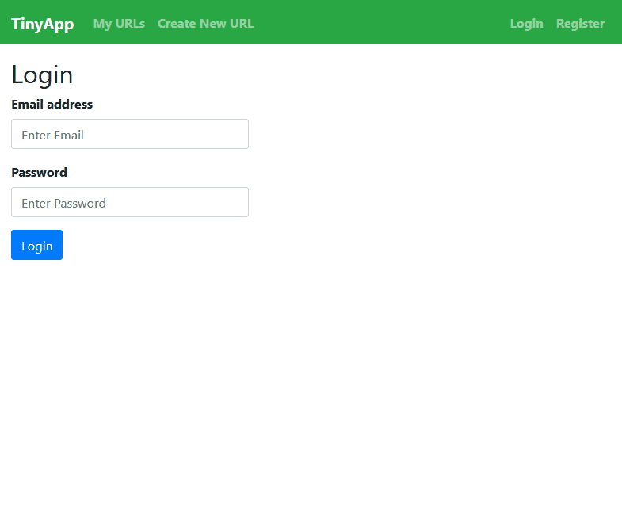
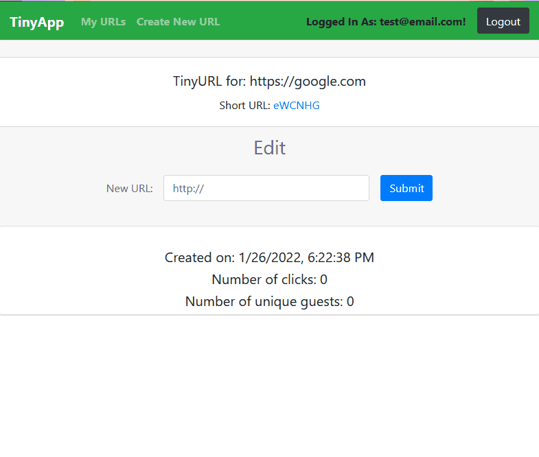

# TinyApp Project

TinyApp is a full stack web application built with Node and Express that allows users to shorten long URLs (à la bit.ly).

## Final Product





## Features
- counts the number of unique guest user clicks
- keeps a log of all link activity


## Dependencies

- Node.js
- Express
- EJS
- bcrypt
- body-parser
- cookie-session
- method-override

## Getting Started

- Install all dependencies:
```
npm install
```

- Run the development web server 
```
npm run start
```